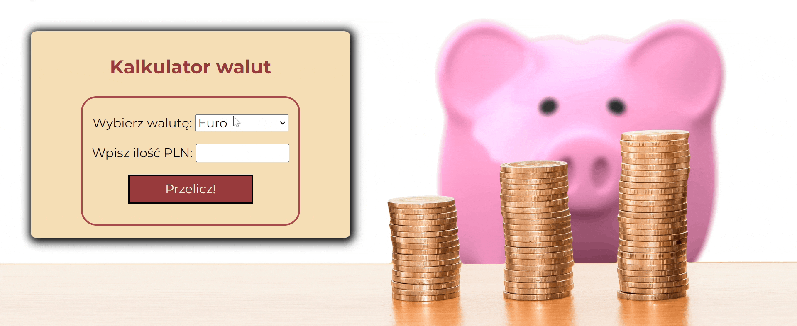

# My first app - currency converter

Made with currency rates from 24.02.2023 just to practice new JS functions I had learned.

Have a quick look how it works:

Done using:
- HTML,
- CSS,
- JS,
- BEM convention,
- MD

Link to the page: *[Currency converter](https://mcbombipl.github.io/currency-converter/)*

#### Switch PLN to:
- EUR,
- USD,
- GBP,
- SEK,
- CZK

